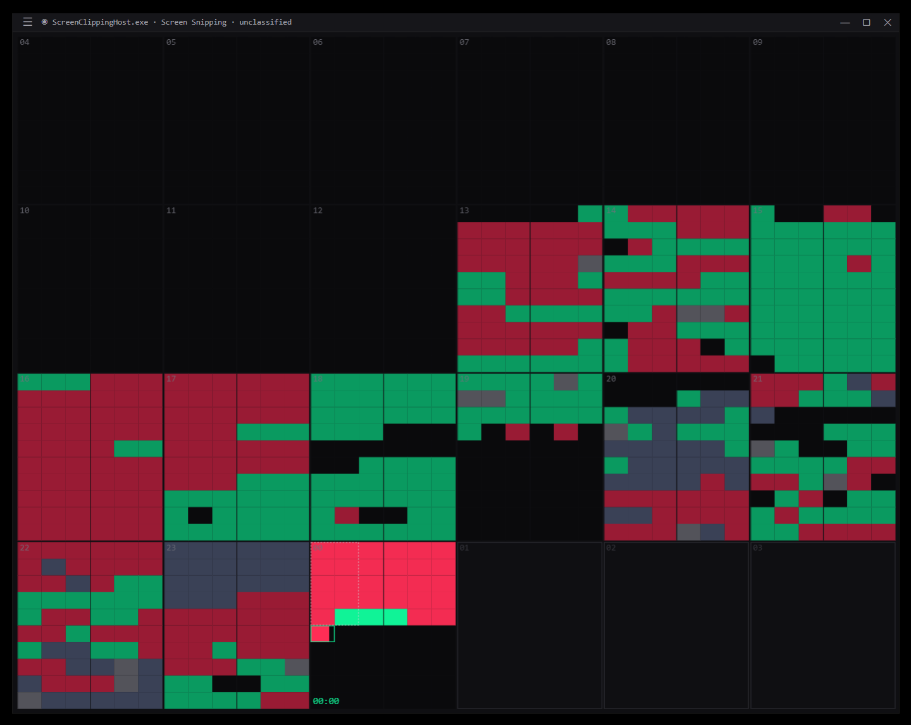

# Hour Mosaic

Ambient time tracker. Your day rendered as a mosaic of 24 hourly tiles on a dark
background — emerald when you're productive, crimson when you're not. Built on
Tauri (Rust + system webview) with a tiny vanilla-TS frontend.

It's meant for a second monitor: an always-on dashboard you glance at once or
twice an hour, not an app you open. The shape and color of the day *is* the UI.



## Install

Windows. Grab the latest installer (`Hour Mosaic_x.y.z_x64-setup.exe`) or the
standalone `.exe` from the releases, run it, and the window appears top-most on
your desktop. Tracking starts immediately; all data stays local at
`%APPDATA%\com.clawbuster.hour-mosaic\hour-mosaic.db`. Optionally enable
**Settings → Timing → Launch at login** to have it start with Windows.

## Features

- **Ambient mosaic** of 24 hour tiles, each minute colored by activity category
  (productive / unproductive / neutral / idle / unclassified / void). `idle`
  (away-from-keyboard) is its own category, separate from a deliberate `neutral`
  break.
- **Adaptive layout** from 150 × 150 px to fullscreen — grid reshapes between
  6×4, 12×2, 24×1 and the inverse, depending on the window's aspect ratio.
- **Live current-hour pulse** with a thin minute progress marker; past hours
  stay uniformly muted (no "older = darker" gradient).
- **Foreground-window tracker** with built-in classification of common apps
  and domains; idle past a configurable threshold (default 5 min) → the `idle`
  category (away), with per-app overrides for video calls (stays active) and
  media players (counts as unproductive).
- **Window grouping** (Settings → Grouping) — choose how windows collapse into
  one tracked entity: *By application* (all Telegram chats / browser tabs as
  one), *By site* (browsers split per domain — the default), or *By window*
  (each window separate, with unread counts and the app's own name stripped so
  near-identical titles still merge). Applies to new minutes immediately.
- **Hover activity readout** — point at any minute and the contiguous run of
  the same activity is framed together, with a tooltip showing the app/window,
  the time span, its length, and category ("Telegram · 14:05–14:37 · 32 мин").
- **Click a minute to classify its app** — set the whole source's category
  (recolors its past, sticks for the future) right from the mosaic. **Drag a
  range** for a manual locked per-minute edit instead. The two popovers are
  visually distinct (green app-classify vs amber manual edit).
- **Global hotkey** `Ctrl+Shift+B` instantly marks the current minute as a
  break.
- **Custom top bar** doubles as the window drag handle and holds the menu,
  status ticker, and window controls (minimize / maximize / quit) — the window
  is frameless.
- **Always-on-top** main window (toggle in the menu, persisted across restarts);
  settings/history windows raise above it when opened.
- **History window** with a 30-day GitHub-style heatmap, drill-down into any
  past day, and aggregated metrics (avg productive/day, best/worst day,
  deep-work streak). Each cell is a true weighted blend of the day's category
  minutes (productive/unproductive/neutral), so contested days read warm rather
  than a flat grey.
- **Classification UI** — assign a category to any observed app/site; the
  choice recolors past minutes and is applied live to future ones. Multi-select
  to classify several at once. Seed defaults cover common apps, and a one-time
  backfill applies them to already-recorded minutes.
- **Settings window** — classification, window grouping, timing (day-start hour
  + idle→break threshold), hotkey reference, and a privacy panel for JSON
  export + wipe.

## Project layout

```
src/                  # frontend (vanilla TS + Canvas)
  mosaic/             # layout solver, Canvas renderer, pulse, progressive disclosure
  editor/             # drag-n-drop hour editor, hover readout, category popover
  history/            # 30-day heatmap, drill-down, metrics
  settings-ui/        # classification, grouping, day-start, privacy
  state/              # IPC wrappers, event listeners, day store
  theme/              # CSS variable tokens + default palette
  ui/                 # hamburger menu, paused overlay
src-tauri/            # Tauri 2 + Rust backend
  src/
    tracker.rs        # tokio loop polling foreground window + idle
    classifier.rs     # rule engine: user rules + seed; window-grouping; title normalize
    aggregator.rs     # sample -> minute (dominant category)
    db.rs             # rusqlite repository
    seed.json         # builtin process / domain / source-key classification defaults
    events.rs         # hm:tick, hm:current-activity emitters
    commands.rs       # IPC surface
index.html            # main window
history.html          # history window
settings.html         # settings window
```

## Develop

```powershell
pnpm install
pnpm tauri dev
```

The first build takes a few minutes while Cargo compiles Tauri and dependent
crates. Subsequent runs reuse the cached target directory.

Type-check the frontend on demand:

```powershell
pnpm exec tsc --noEmit
```

Rust check without bundling:

```powershell
cd src-tauri
cargo check
```

## Build a production binary

```powershell
pnpm tauri build
```

Produces an NSIS installer under `src-tauri/target/release/bundle/nsis/`. On
first run the app stores its SQLite database at
`%APPDATA%\com.clawbuster.hour-mosaic\hour-mosaic.db`.

## Platforms

Windows-first. The foreground-window crate (`active-win-pos-rs`) is
cross-platform, but idle detection uses the Win32 `GetLastInputInfo` API and the
build is currently only verified on Windows.

## Tracking philosophy

- The current hour is bright and pulses; everything else is muted but keeps
  per-minute detail. You can't change the past, but you can shape the next
  minute.
- No notifications, no "productivity score" badges, no streak celebrations.
  The colors are the data.
- All data stays on your machine. There is no telemetry and no cloud sync.

## License

See [LICENSE](LICENSE).
